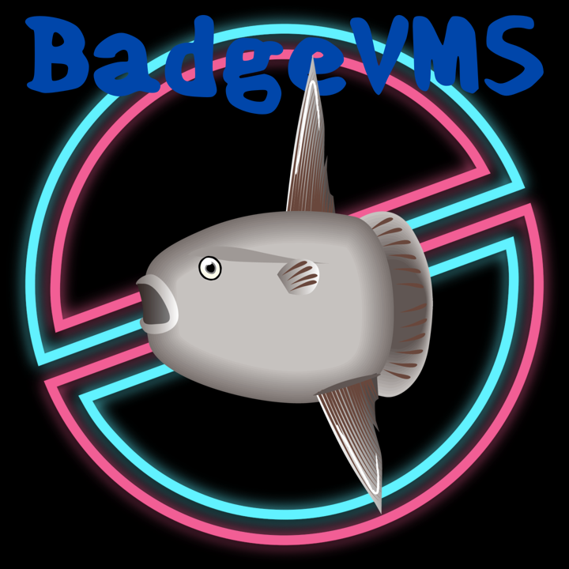

# DutchVMS

DutchVMS is [CJ van Soest](https://github.com/CJvanSoest)'s fork of
[BadgeVMS](https://gitlab.com/why2025/team-badge/firmware), the WHY2025 camp
badge operating system, for the ESP32-P4-based WHY2025 badge. See
[DUTCHVMS.md](DUTCHVMS.md) for exactly what this fork changes versus
upstream and why.



Some feature highlights (inherited from BadgeVMS):

* Multiple programs can run at once
* Every program gets its own linear address space
* Programs are isolated from each other (but not the operating system)
* VMS-like paths and search lists

# Supported hardware

* WHY2025 badge (ESP32-P4 app processor + ESP32-C6 radio co-processor)

# Get started

* **Flashing a badge** (first time, or updating an existing one): see
  [docs/guides/Flashing.md](docs/guides/Flashing.md).
* **Cutting a release**: see [docs/guides/Releases.md](docs/guides/Releases.md).
* **What changed recently**: see [docs/CHANGELOG.md](docs/CHANGELOG.md).
* **Apps** (the actual user-facing programs — MeshCore, storage viewer,
  WiFi analyzer, etc.) live in a separate repo,
  [why2025-apps](https://github.com/CJvanSoest/why2025-apps), and are
  distributed via [why2025-app-repository](https://github.com/CJvanSoest/why2025-app-repository).
  This repo is firmware only.

# Building from source

You need ESP-IDF 5.5 installed. See
https://docs.espressif.com/projects/esp-idf/en/stable/esp32/get-started/index.html
for installation instructions.

```bash
. $IDF_PATH/export.sh
idf.py build
```

This builds both the P4 firmware (`build/badgevms.bin`) and drives the
`connectivity_esp_hosted` sub-build for the C6 co-processor firmware. See
[docs/guides/Flashing.md](docs/guides/Flashing.md) for how to actually get
either onto a badge.

_Note: after a `git pull`, run `idf.py fullclean` before rebuilding so
changes to `sdkconfig.defaults` are picked up._

# Example applications

The directory [sdk_apps](sdk_apps) has several small programs demonstrating
the BadgeVMS SDK. These are generic BadgeVMS examples, not this fork's actual
apps (those are in the separate [why2025-apps](https://github.com/CJvanSoest/why2025-apps)
repo — see [DUTCHVMS.md](DUTCHVMS.md)).

* [framebuffer_test](sdk_apps/framebuffer_test) shows you how to directly interact with the windowing system and keyboard input.
* [curl_test](sdk_apps/curl_test) shows you how to do http(s) calls.
* [thread_test](sdk_apps/thread_test) has a simple example of creating a thread and how to interact with workers.
* [wifi_test](sdk_apps/wifi_test), [socket_test](sdk_apps/socket_test), [readdir_test](sdk_apps/readdir_test), [process_test](sdk_apps/process_test), [bmi270_test](sdk_apps/bmi270_test) — smaller focused examples, one concept each.
* [hardware_test](sdk_apps/hardware_test) and [memtester](sdk_apps/memtester) — diagnostic/self-test apps.

Finally, as a more complete example, there is also [doomgeneric](sdk_apps/doomgeneric), a full-fledged Doom port! In particular check out [doomgeneric_badgevms.c](sdk_apps/doomgeneric/doomgeneric/doomgeneric_badgevms.c) for examples of framebuffers, scaling, window handling, input, etc.

Apps that shipped with the original WHY2025 handout firmware but are no
longer built or relevant here (an old on-device OTA updater, orphaned
example apps) live in [Archive/](Archive) instead of being deleted outright
— see [Archive/README.md](Archive/README.md) for what's there and why.

# Building applications

BadgeVMS has a simple SDK with C, BadgeVMS headers, SDL3, and SDL2. You can build the SDK with

```
idf.py sdk
```

This will generate a directory `sdk_dist` with the headers and libraries.

You then need to use a riscv32 compiler to build for BadgeVMS, one way of doing that is by reusing the `riscv32-esp-elf-*` toolchain that comes with esp-idf, however any riscv32 compiler should work. But only GCC is tested. Example (with esp-idf compilers):

```
riscv32-esp-elf-gcc -O2 -fPIC -fdata-sections -ffunction-sections -flto \
   -fno-builtin -fno-builtin-function -fno-jump-tables -fno-tree-switch-conversion \
   -fstrict-volatile-bitfields -fvisibility=hidden -g3 -mabi=ilp32f \
   -march=rv32imafc_zicsr_zifencei -nostartfiles -nostdlib -shared \
   -Wl,--strip-debug -Wl,--gc-sections -e main --sysroot sdk_dist -isystem sdk_dist/include \
   hello.c -o hello.elf
```

This also works with for instance `riscv64-linux-gnu-gcc` as shipped by Fedora 42.

# Linking with the SDK libraries

Due to limitations in the ELF loader in BadgeVMS, do not expose symbols in your program other than `main`, with the default flags above (`-fvisibility=hidden`) this is mostly taken care of, but if linking with an `.a` file, especially one not shipped with the SDK, things might go wrong.

In order to link properly with an `.a` file for BadgeVMS please use `-Wl,--exclude-libs,libmylib.a`

# Weird things to keep in mind

 * UNIX paths do not work! Paths are in the form of `DEVICE:[directory.subdirectory]filename.ext`
 * The various GCC options above are not optional. BadgeVMS binaries are position independent ELF shared objects. Other types of binaries will not load.
 * No shared libraries, you there is no `dlopen()` either, all of your dependencies (that is, symbols that come from places other than what is included with the sdk) must be fully statically linked.

# License

GPL-3.0-or-later — see [COPYING](COPYING). See [CREDITS.md](CREDITS.md) for upstream/third-party attribution.
